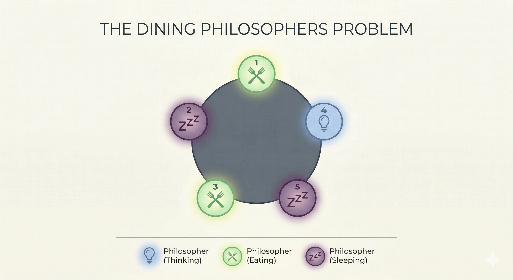

*This project has been created as part of the 42 curriculum by anashwan*
# Philosophers
## Description

Have you ever wondered how your computer can run multiple applications at the same time, even though its resources are limited?
This project explores that idea through the [The Dining Philosophers problem](https://en.wikipedia.org/wiki/Dining_philosophers_problem), demonstrating how threads within the same process share resources and how this can lead to synchronization issues.

### The Problem


- One or more philosophers sit at a round table.
  There is a large bowl of spaghetti in the middle of the table.

- The philosophers take turns eating, thinking, and sleeping.
  While eating, they are not thinking or sleeping;
  while thinking, they are not eating or sleeping;
  and while sleeping, they are not eating or thinking.

- There are as many forks as philosophers, placed between them.

- Since eating spaghetti with one fork is impractical,
  a philosopher must pick up both the fork to their left
  and the fork to their right before eating.

- After eating, a philosopher puts down both forks and starts sleeping.
  Once awake, they begin thinking again.

- The simulation stops when a philosopher dies of starvation.

- Every philosopher must eat and should never starve.

- Philosophers do not communicate with each other.

- Philosophers are unaware of the state of others.

- Needless to say, philosophers should avoid dying.

### Introduction
A [process](https://www.geeksforgeeks.org/operating-systems/process-in-operating-system/) is a program loaded into memory for execution.
Each process can contain multiple [threads](https://www.geeksforgeeks.org/operating-systems/thread-in-operating-system/), threads are the smallest units of execution handled by the CPU.

A helpful way to think about this is:
A process is like a company, and threads are its employees.
Each employee performs a specific task **at the same time**, but they all share the same office.

Because threads share the same memory and resources, they may try to access them simultaneously.
This leads to race conditions and resource conflicts, which will cause a lot of issues and data corruption.

To solve this, we use mutexes (locks):
- A thread locks a resource before using it
- Other threads must wait until it is unlocked
- Once finished, the thread releases the resource

However, simply locking resources is not enough. We must also ensure that:
1. Threads release resources properly
2. No thread holds a resource for too long
3. The system does not enter a deadlock

### Mapping the Problem
In this simulation:
```
Philosophers → Threads
Forks → Mutexes (Shared resources)
```

Each philosopher:
1. Takes (locks) two forks
2. Eats
3. Releases (unlocks) the forks
4. Sleeps
5. Thinks
6. Repeats

### Constraints & Arguments
Each philosopher operates under strict timing rules:
- `time_to_eat`: duration of eating
- `time_to_sleep`: duration of sleeping
- `time_to_die`: maximum time without eating before death
- `limit` (optional): If all philosophers reach meal limit, the simulation stops.

A philosopher must eat before time_to_die expires, or they will starve and the simulation will stop.

### Goal
The objective is to design a system where:
- No philosopher starves
- No deadlocks occur
- Resource access is properly synchronized

We use the `pthread.h` library to create threads and mutexes and destry them.
## Instructions

### Compiling
```bash
make
```

### Executing
```bash
./philo N time_to_die time_to_eat time_to_sleep [limit]
```
- N: Number of philosophers(and forks)
- limit(optional): The number of times each philosopher needs to eat before the end of the simulation.

### Examples
```bash
./philo 2 800 200 200
```
-> This simulation runs forever.
```bash
./philo 2 800 200 200 5
```
-> This simulation will stop because each philosopher will eat 5 meals.

```bash
./philo 5 800 200 200
```
-> One of the philosophers will not get his forks on time, he will die. The simulation stops.
## Resources
### Concepts
[The dining philosophers problem](https://en.wikipedia.org/wiki/Dining_philosophers_problem)

[The difference between a process and a program - Video](https://youtu.be/7ge7u5VUSbE)

[What a process actually is - Video](https://youtu.be/LDhoD4IVElk?list=PL9vTTBa7QaQPdvEuMTqS9McY-ieaweU8M)

[Threads and why we use them - Video](https://youtu.be/M9HHWFp84f0?list=PL9vTTBa7QaQPdvEuMTqS9McY-ieaweU8M)

[Threads, Mutexes and Concurrent Programming in C - Article](https://www.codequoi.com/en/threads-mutexes-and-concurrent-programming-in-c/)

[Data race, Deadlocks, and Resource Starvation - Article](https://medium.com/@qingedaig/race-conditions-vs-deadlocks-vs-resource-starvation-32e26b039cc2)
### Dealing with threads and mutexes in C
[Threads in C - Playlist](https://www.youtube.com/playlist?list=PLfqABt5AS4FmuQf70psXrsMLEDQXNkLq2)
